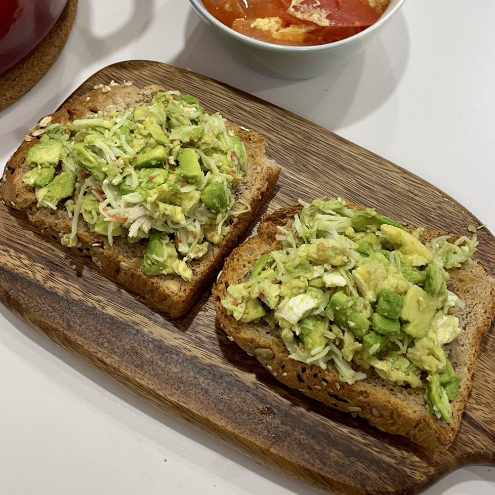

# 牛油果鸡蛋吐司

我爱牛油果，我爱鸡蛋。面包可以加万物，随便加。

## 原料

- 牛油果1个
- 鸡蛋1个
- 吐司2片
- 盐

## 操作

### 牛油果的处理（注意手）

1. 牛油果一定要熟，皮上的绿色不能太多，也不能全黑（过熟了）
2. 切刀进去感觉到核，沿着核切开，上下旋一下，两边分离
3. 刀刃卡进核里，把核取出来
4. 带着牛油果的皮，斜着切成片（像切芒果一样，但不用切成小方块）
5. 拿一个薄勺子，完整挖出牛油果片
6. 压碎牛油果，可以保留一些牛油果块

### 煎蛋

鸡蛋加入少许盐打散，一点油煎成比较嫩的状态。

混合进牛油果

### 吐司

常温的吐司复烤注意温度和时间，180度烤3min。

### 涂抹

1. 奶酪/...各种酱，涂在吐司上
2. 牛油果和鸡蛋抹在吐司上

## 其他

加入蟹柳之后，感觉蟹柳太抢味了。还是喜欢单纯的牛油果香味。