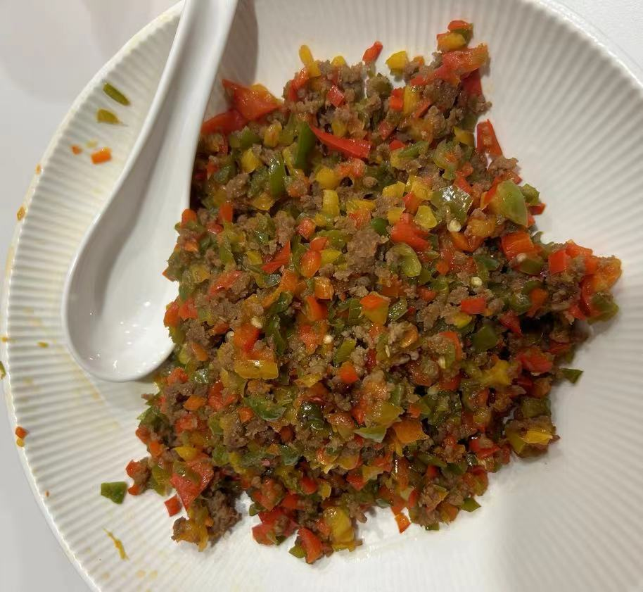

# 三椒炒牛肉

顶级湖南菜，非常下饭，可以狂干五碗饭。

## 原料

- 螺丝椒四条
- 红辣椒黄辣椒 各一个
- 牛肉200克
- 朝天椒一根（怕辣的半根就足够了）

## 操作

### 备菜

1. 将螺丝椒切丁
2. 红辣椒黄辣椒切丁
3. 朝天椒 切丁
4. 牛肉切肉末，加食用油，料酒，酱油腌制

### 烘烤

1. 什么都不加，直接下所有辣椒加入锅中翻炒，直到水分蒸发干净。当开始冒白烟了就把辣椒捞出
2. 加油，下牛肉翻炒，知道肉末变色
3. 下所有辣椒翻炒
4. 加一些盐和酱油调味
5. 出锅

