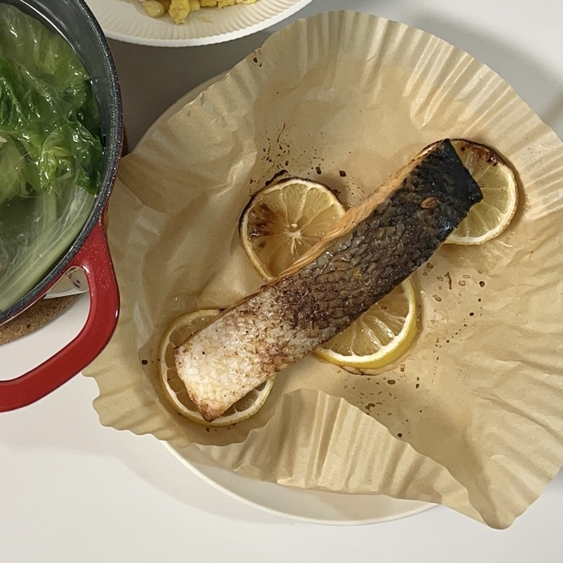

# 柠香烤三文鱼

三文鱼加入柠檬汁，风味更好。

## 原料

- 三文鱼块
- 柠檬半个
- 盐
- 黑胡椒
- 烹饪工具：空气炸锅

## 操作

### 解冻与腌制

1. 三文鱼提前解冻，室温20度大概需要2h
2. 解冻好后，厨房纸吸干水分
3. 在三文鱼表面撒上盐和黑胡椒（2小茶匙盐）
4. 柠檬切4片，剩下的柠檬挤汁到三文鱼表面（柠檬汁多点更入味）
5. 腌制15min

### 烘烤

1. 空气炸锅烤纸上放上4片柠檬垫底
2. 把腌好的三文鱼，鱼皮朝上，放在柠檬片上
3. 空气炸锅185度15min（如果空气炸锅只有上管，需要翻面）
   - 该温度和时间下，鱼皮已烤脆，内部鱼肉较嫩
   - 带鱼皮的三文鱼脂肪多，无需加油

