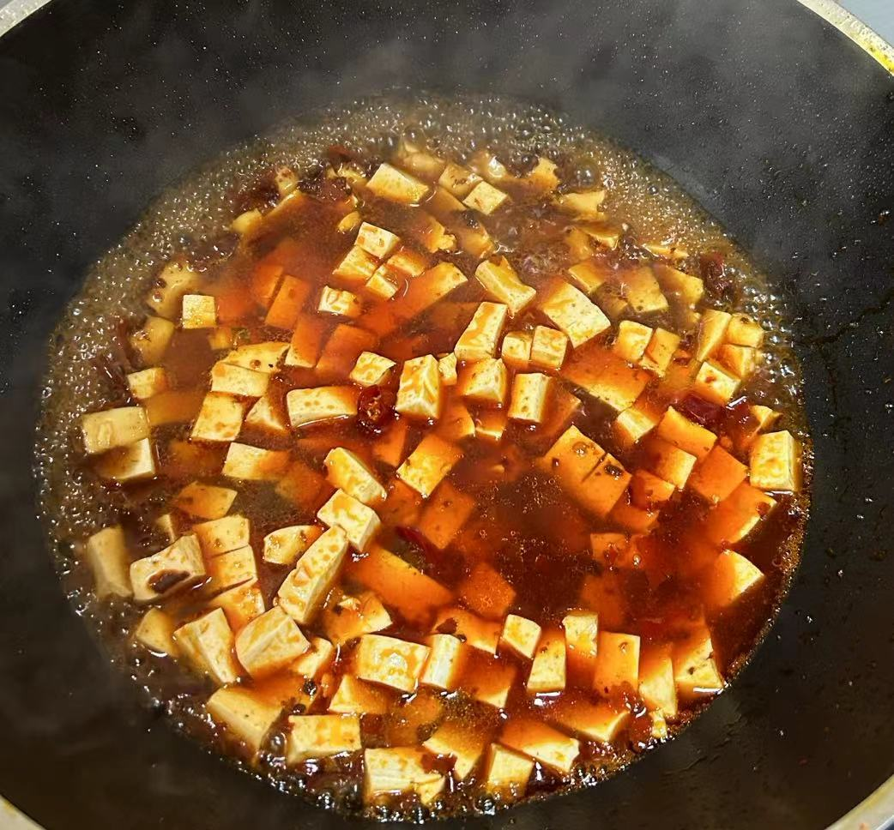

# 麻婆豆腐

## 原料

- 郫县豆瓣酱（鹃城牌好吃）
- 朝天椒半根
- 豆腐
- 猪肉
- 蒜末

## 操作

### 备菜

1. 豆腐、朝天椒切丁
2. 猪肉切肉末，加食用油，生粉，料酒，酱油腌制

### 烘烤

1. 加花生油，小火下蒜末和朝天椒丁，爆香。
2. 下豆瓣酱翻炒出红油
3. 下猪肉末翻炒，直到变色
4. 下豆腐，加一到两碗水（水不要太多！）
5. 闷一会后加一些生粉收汁
6. 出锅！

