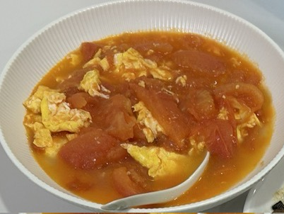

# 西红柿炒鸡蛋

## 必备原料和工具

- 西红柿
- 鸡蛋
- 食用油
- 盐
- 糖

## 操作

以下以两人份介绍：

- 两个西红柿冲洗后切块。
- 3-4个鸡蛋打入碗中搅匀
- 热锅，加入食用油，油加多一点，鸡蛋才不会粘锅切更滑。
- 油热后，倒入鸡蛋液，静态几秒后，搅动鸡蛋，此时鸡蛋应该是很嫩，半流体半固体的半熟状态。
- 关火。将半熟鸡蛋盛盘，重新开火

  - 注意：不要洗锅
- 加一些油，加入 `西红柿块`，锅铲拍打并翻炒 20 秒，或至西红柿软烂（可以盖上锅盖焖一会）
- 向锅中加入半熟鸡蛋，翻炒均匀，如果太干可以加一些水，这样就可以有番茄汤

- 加入剩余的盐、糖，翻炒均匀
- 关火，盛盘