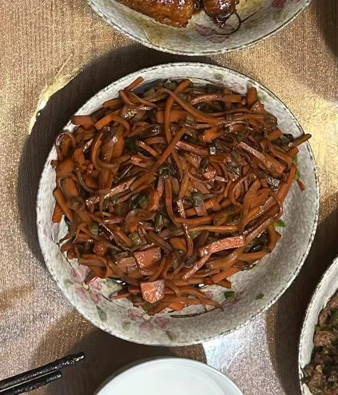

# 醋炒胡萝卜

酸甜可口的炒胡萝卜，非常下饭。

## 备菜

以两人份为例，更多人其实也差不多，因为会有更多菜

- 胡萝卜 2根，削皮切丝
- 花生油
- 蒜头切碎
- 酱油
- 陈醋

## 流程

1. 锅热倒油，胡萝卜很吃油一定要加多一些会好吃
2. 调小火，在油温不会太高的时候下蒜头碎，这样不会变黑
3. 下胡萝卜，翻炒，直到胡萝卜都吸满油，变得金黄。
4. 下陈醋，根据个人口味来放。我们比较喜欢算会放2-3铲子的陈醋，胡萝卜会变黑但很下饭。
5. 下一铲子酱油
6. 试一下咸淡，调整醋和酱油的量。
7. 翻炒出锅。